# College Placement Manager

> **Thinqloud Solutions Campus Hiring Assessment Project**  
> An end-to-end web platform designed to streamline campus recruitment: manage student profiles, partner companies, placement drives with dynamic eligibility rules, multi-stage interview evaluations, and automated placement records.

---

## 🌟 Core Business Workflow

```mermaid
graph LR
    A[Admin Creates Company] --> B[Admin Launches Placement Drive]
    B --> C[Configure Eligibility Rules]
    C --> D[System Evaluates Student Eligibility]
    D --> E[Eligible Student Applies]
    E --> F[Screening & Shortlisting]
    F --> G[Multi-Stage Interview Rounds]
    G --> H[Record Evaluation Feedback]
    H --> I[Select Candidate]
    I --> J[Automated Placement Record & CTC Offer]
```



---

## 🚀 Key Features

### 1. 🛡️ Role-Based Portals (Admin & Student)
* **Placement Cell Admin:**
  - Dynamic Dashboard with live metrics (Total Placed, Open Drives, Average CTC Package, Application Pipeline breakdown).
  - Student Directory with filters, academic metrics (CGPA, Backlogs, Batch), and profile editing.
  - Corporate Partner Management (Companies, contacts, industries).
  - Drive Creator with custom criteria (Departments, Min CGPA, Max Backlogs, Graduation Year).
  - Real-time **Eligible Candidate Pool calculation**.
  - Multi-round Interview Management (Round scheduling, `PASSED`/`FAILED` result recording with feedback notes).
  - 1-Click Candidate Selection (`SELECTED`) with automated creation of official `Placement` records.
* **Student Candidate:**
  - Student Dashboard with active recruitment stats.
  - Active Placement Drives with **real-time eligibility badges** (clear breakdown of reasons if ineligible).
  - 1-Click Application Submission.
  - "My Applications" lifecycle tracker showing interview progression and coordinator feedback.
  - Official Placement Offers viewer.

### 2. ⚡ Dynamic Eligibility Calculation Engine
Evaluates candidate eligibility across four core parameters:
1. **Target Department:** Supports specific departments (e.g. `CSE,IT`) or `ALL`.
2. **Minimum CGPA:** Exact cutoff check (e.g. $\ge 7.0$).
3. **Maximum Backlogs:** Active backlog tolerance limit (e.g. $\le 0$ or $\le 1$).
4. **Graduation Year:** Matching graduation batch (e.g. `2026`).

---

## 🛠️ Technology Stack

| Layer | Technology | Description |
|---|---|---|
| **Backend** | Java 21 / Spring Boot 3.3.4 | Monolithic REST architecture |
| **Security** | Spring Security 6 + JJWT | Stateless JWT authentication & RBAC |
| **Database** | PostgreSQL 18 | Relational schema with foreign keys & unique constraints |
| **ORM** | Spring Data JPA / Hibernate | DDL auto-generation and entity lifecycle |
| **Frontend** | React 18 + Vite | High-performance SPA |
| **Styling** | Custom Responsive CSS | Glassmorphism cards, badges, and modern design tokens |
| **Deployment** | Docker & Docker Compose | Multi-stage containerization with Nginx reverse proxy |

---

## ⚡ Quick Start (Local Development)

### Prerequisites
* Java 21 (or Temurin JDK)
* PostgreSQL 16+ running on `localhost:5432`
* Node.js 18+ and npm

### 1. Database Setup
Ensure PostgreSQL is running and database `placement_db` exists:
```sql
CREATE DATABASE placement_db;
```

### 2. Start Backend
```bash
cd backend
./mvnw spring-boot:run
```
* Backend runs on: `http://localhost:8080`
* Default demo accounts are automatically seeded on first startup.

### 3. Start Frontend
```bash
cd frontend
npm install
npm run dev
```
* Frontend runs on: `http://localhost:5173`

---

## 🐳 Docker Deployment

To launch the full stack (PostgreSQL + Spring Boot Backend + React Frontend):
```bash
docker-compose up --build
```
* Access frontend at `http://localhost` (or `http://localhost:5173`).

---

## 👥 Demo Credentials

| Role | Email | Password | Profile Highlights |
|---|---|---|---|
| **Admin** | `admin@placement.com` | `Admin@123` | Placement Cell Officer (Full Privileges) |
| **Student** | `john.cse@placement.com` | `Student@123` | John Doe (CSE, 8.75 CGPA) — Placed at Thinqloud (10.5 LPA) |
| **Student** | `sarah.it@placement.com` | `Student@123` | Sarah Jenkins (IT, 7.60 CGPA) — Active in Interview Rounds |
| **Student** | `rachel.mech@placement.com` | `Student@123` | Rachel Green (MECH, 8.20 CGPA) — Used to test Department Eligibility Filter |
| **Student** | `alex.ece@placement.com` | `Student@123` | Alex Rivera (ECE, 6.40 CGPA, 1 Backlog) |

*(Note: The login page includes 1-click quick login buttons for all demo profiles for instant demonstration).*

---

## 📚 Project Documentation
* [System Architecture Specification](file:///e:/Thniqulod/ARCHITECTURE.md)
* [REST API Catalog](file:///e:/Thniqulod/API.md)
* [5-Minute Live Demo Walkthrough Script](file:///e:/Thniqulod/DEMO_GUIDE.md)
* [Development Notes & Design Decisions](file:///e:/Thniqulod/DEVELOPMENT_NOTES.md)
